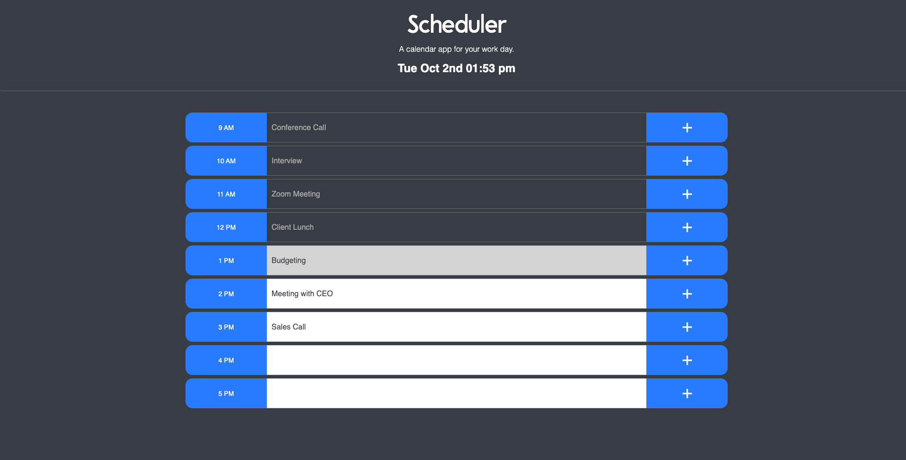

# scheduler

## project description

The goal of this project was to create a simple calendar application that allows a user to save work events for each hour of the day by modifying starter code. This app runs in a web browser and features dynamically updated HTML and CSS powered by jQuery. I utilized the [Moment.js](https://momentjs.com/) library to work with the date and time feature located in the Jumbotron. When a time block is in the 'past' it is assigned a color of gray. When a time block is in the 'present' it is assigned a color of red. When a time block is in the 'future' it is assigned a color of green. When a user refreshes the page, the input in a time block (if input exists) persists until the user clears it from the time block OR clears it in localStorage.

## challenge - local storage

The biggest challenge in this project was setting up local storage methods so that the user's input is able to be stored on a click even and then displayed in the viewport after a page refresh. In order to set this up, I had to utilize the 'setItem' and 'getItem' methods. The 'setItem' method allows the application to save the key/value pair of the user's input into localStorage. The 'getItem' method allows the application to 'get' the key/value pair from localStorage and then display it to the corresponding element in the viewport and persist after a page refresh.

## conclusion

This project provided the opportunity to learn more in-depth about localStorage as well as how to ulitlze MomentJS in an application. Scheduling is a big part of my current job and I look forward to expanding this application to include more complex features to make it more usable in my day to day life.

## URL to deployed application

[Work Day Scheduler](https://mychalgm.github.io/scheduler) 
[Repository](https://github.com/mychalgm/scheduler)

## application screenshots

## resources

Study Group 
Teacher's Assistant 
